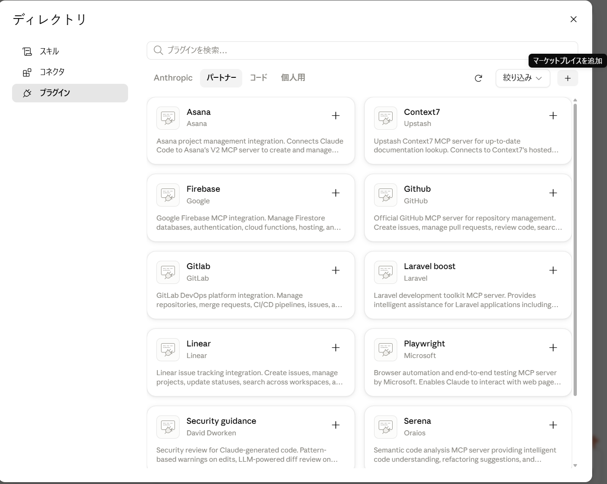
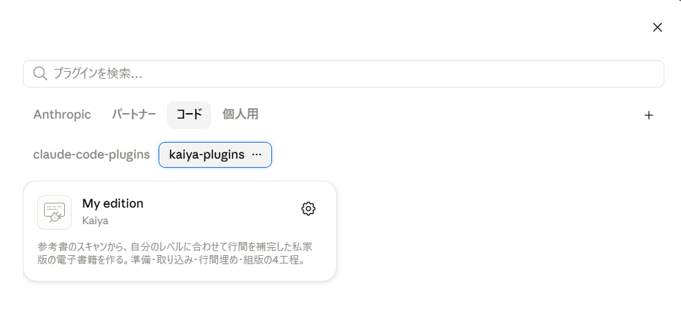

# kaiya-plugins

Claude Code のプラグイン置き場です。いまは1つだけ入っています。

| プラグイン | 何をするもの |
|---|---|
| **[my-edition](plugins/my-edition/)** | 参考書のスキャンから、**自分のレベルに合わせて行間を補完した「マイ教科書」**を作る |

---

## 導入のしかた

**ターミナルも設定ファイルも使いません。**画面の操作だけで入ります。

### 1. プラグインの画面を開く

プロンプト欄の **＋ → Plugins**。サイドバーの **Customize → Plugins** でも同じです。

### 2. 置き場所を登録する

右上の **＋** を押して、**「リポジトリから追加」**を選びます。



出てきた欄に、これを入れてください。

```
Kaiya-study/claude-plugins
```

同期が終わると、置き場所が登録されます。**一度やれば、以後は不要です。**

### 3. 入れる

**「コード」タブ**に切り替えます。既定の「Anthropic」タブは Anthropic 製のものだけなので、
そこを見ていても見つかりません。



`kaiya-plugins` を選ぶと `My edition` のカードが出るので、**「＋」**を押します。
入れる範囲を聞かれたら **「ユーザー」** を選んでください。
どのフォルダで作業しても使えるようになります。

<details>
<summary>ターミナルを使いたい場合</summary>

```
claude plugin marketplace add Kaiya-study/claude-plugins
claude plugin install my-edition@kaiya-plugins
```

</details>

<details>
<summary>設定ファイル（settings.json）に書く方法について</summary>

`~/.claude/settings.json` の `extraKnownMarketplaces` に手で書く方法もありますが、**勧めません。**

- 書いても**取得が走らず**、プラグインの一覧に何も出ないことがあります
- 手で書いたあとに画面から追加しようとすると、
  「its network source differs from the one declared for it in settings」という
  **エラーで必ず失敗します**（画面側は入力を `https://github.com/…​.git` の形に直して送るため、
  手で書いた `github` 形式と食い違います）
- 既存の項目の**中**に入れてしまう間違いが起きやすく、JSON としては壊れないので**気づけません**

上の画面操作で追加すれば、**アプリが自分で settings.json に書き込みます。**触る必要はありません。

</details>

---

入れ終わったら、あとは写真を渡して「行間を埋めて」と言うだけです。

---

## 使うのに必要なもの

- **Claude の有料プラン**（Pro 以上）。**無料プランでは Claude Code そのものが使えません**
  （[公式ドキュメント](https://code.claude.com/docs/en/setup#authenticate)。2026年9月9日現在）
- **Claude デスクトップアプリの Code タブ**（**Chat タブでは動きません**）

GitHub のアカウントも git も要りません。公開リポジトリを読みに行くだけです。

---

## ライセンス

MIT（[LICENSE](LICENSE)）。

`my-edition` は数式の表示に [MathJax](https://www.mathjax.org/)（Apache-2.0）を使いますが、
**同梱していません。**最初の組版のときに一度だけ取得して、以後は使い回します。
