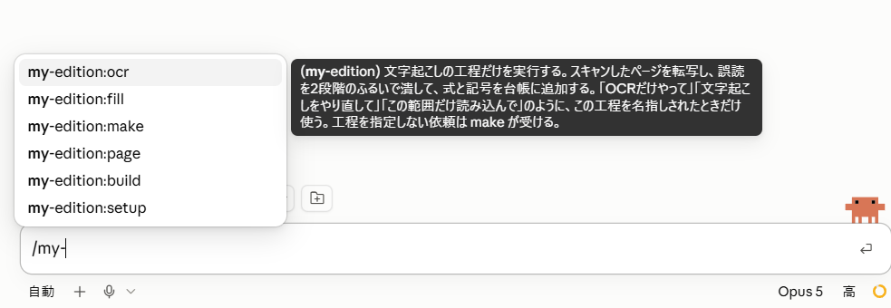

# my-edition

**参考書のスキャンから、自分のレベルに合わせて行間を補完した「マイ教科書」を作る。**

有名な参考書に着手したものの、計算（本質ではないところ）が難しくて挫折した——
そういう本を、自分が読み切れる形に組み直すための道具です。

作られるのは注釈集ではありません。**本文が丸ごと入っていて、あなたが知らないことだけが
補完されている一冊**です。参考書を開かなくても、これだけで読み切れます。

---

## できること

- スキャンした参考書のページを文字起こしし、誤読を2段階で潰す
  （**本文データが手元にあれば、この工程ごと飛ばせます**）
- 著者が省略した推論や計算を探し、**あなたが自分で検証できる粒度**で埋める
- 本の主張そのものは埋めません。境目が怪しいところも埋めません
- 原著の記述と補完を混ぜずに、目次つきのHTML1ファイルとして組む
- 式番号をクリックすると初出へジャンプ、ホバーで式が見える
- 各式に「この式を使うところ」が出る（逆引き）。章を足すほど、前の章の式にも増えていく
- 「原著のみ表示」で、補った部分を一括で畳める
- 詰まったら、その場から質問文をコピーしてAIに聞ける

あなたが既に知っている操作には行間を作りません。**レベルが変われば、同じ本から別の版ができます。**

---

## 使うのに必要なもの

**写真から試すだけなら、これだけです。**

- **Claude の有料プラン**（Pro 以上）。**無料プランでは Claude Code そのものが使えません**
  （[公式ドキュメント](https://code.claude.com/docs/en/setup#authenticate)。2026年9月9日現在。
  プランの仕様は変わるので、この日付を見て自分で確認してください）。
  **軽いモデルでは、満足のいく行間になりません。**ここは実感としてはっきり差が出ます
- **Claude デスクトップアプリの Code タブ**（Chat タブでは動きません）
- 読みたいもの1ページ（参考書でも、論文でも、自分のノートでも）

ターミナルは要りません。追加の従量課金もかかりません。かかるのは時間だけです。

**一冊まるごとやる場合は、フォルダを開いて作業します。**

数日から数週間かかるので、途中経過をファイルに残しながら進めるためです。
**デスクトップアプリの Code タブでも、VS Code でも構いません。**
あわせて、スキャン画像か本文データが要ります。

---

## 導入のしかた

**ターミナルも設定ファイルも使いません。**画面の操作だけで入ります。

### 1. プラグインの画面を開く

プロンプト欄の **＋ → Plugins**。サイドバーの **Customize → Plugins** でも同じです。

### 2. 置き場所を登録する

右上の **＋** を押して、**「リポジトリから追加」**を選びます。


出てきた欄に、これを入れてください。

```
Kaiya-study/claude-plugins
```

同期が終わると、置き場所が登録されます。**一度やれば、以後は不要です。**

### 3. 入れる

**「コード」タブ**に切り替えます。既定の「Anthropic」タブは Anthropic 製のものだけなので、
そこを見ていても見つかりません。


`kaiya-plugins` を選ぶと `My edition` のカードが出るので、**「＋」**を押します。
入れる範囲を聞かれたら **「ユーザー」** を選んでください。
どのフォルダで作業しても使えるようになります。

### 4. 入ったか確かめる

新しいセッションで `/my-` と打ってみてください。
次のように候補が出れば、入っています。



出てこないときは、アプリを完全に終了してから開き直してください。

<details>
<summary>ターミナルを使いたい場合</summary>

```
claude plugin marketplace add Kaiya-study/claude-plugins
claude plugin install my-edition@kaiya-plugins
```

</details>

<details>
<summary>設定ファイル（settings.json）に書く方法について</summary>

`~/.claude/settings.json` の `extraKnownMarketplaces` に手で書く方法もありますが、**勧めません。**

- 書いても**取得が走らず**、プラグインの一覧に何も出ないことがあります
- 手で書いたあとに画面から追加しようとすると、
  「its network source differs from the one declared for it in settings」という
  **エラーで必ず失敗します**（画面側は入力を `https://github.com/…​.git` の形に直して送るため、
  手で書いた `github` 形式と食い違います）
- 既存の項目の**中**に入れてしまう間違いが起きやすく、JSON としては壊れないので**気づけません**

上の画面操作で追加すれば、**アプリが自分で settings.json に書き込みます。**触る必要はありません。

</details>

---

入れ終わったら、あとは写真を渡して「行間を埋めて」と言うだけです。

---

## 三通りの使い方

規模に応じて3つあります。**まずいちばん軽いものから試してください。**

| | 入力 | 場所 | 準備 | 向いている場面 |
|---|---|---|---|---|
| **写真から** | ページの写真 | 話すだけ | **なし** | 今日この数ページが読めない |
| ファイルから | 小さめのPDF | 話すだけ | なし | 1節・1章ぶんを読めるようにしたい |
| 一冊まるごと | スキャン画像のフォルダ | **フォルダを開く** | 目次読み取り・較正 | その本を完遂したい |

**本文データ（LaTeX ソース、文字起こし済みのテキスト）が手元にあるなら、
スキャンと文字起こしは飛ばせます。**「一冊まるごと」の入口から始めてください。
ただし、持ち込んだ本文の忠実さはこの道具では保証できません（下の「設計上の約束」）。

---

## 写真から（いちばん軽い）

準備は要りません。**参考書のページを撮って、こう言うだけです。**

> このページの行間を埋めて

読んで、著者が省略していたものを埋めて、**読めるHTMLにまとめて**返します。

途中で「この式は前のページの (1.7) を使っています。そこも撮って送ってください」と
頼まれることがあります。**写真を足していけば、そのファイルが育ちます。**

はじめに「この資料は `相対論` としてまとめますか？」と一度だけ聞かれます。
**資料ごとに置き場所が分かれる**ので、別の本を並行して読んでも混ざりません。
別の日に撮った続きも、同じところに足されていきます。

目次も、事前のプロファイル作りも要りません。追加費用もかかりません。

そのページに実際に出てくる操作について、**最初の一度だけ**聞かれます。答えはそのまま残るので、
**写真を足しても、同じことは聞かれません。**
粒度が合わないと感じたら、読んでいて引っかかったところを質問すれば、そこから変わります。

**合いそうだと思ったら**、次に進んでください。

---

## 一冊まるごと

**話しかけるだけです。**

> このフォルダで教科書を作ってください

これで始まります。どこまで終わっているかは自動で判断されるので、次の日も同じことを言えば続きから進みます。

> 続きをやってください

工程を覚える必要はありません。以下は**やり直したいときだけ**使う個別の呼び出しです。

<details>
<summary>工程ごとに呼び出したいとき</summary>

### 1. 準備する — `/my-edition:setup`

スキャン画像のフォルダ、または本文データを渡すと、次を済ませます。

- 目次を読んで章の構成を取る
- 印刷ページ番号とスキャンファイル番号のズレを較正する（**本文データなら不要**）
- 巻末の記号表を取り込む
- あなたの学力プロファイルを作る（**その本に出てくる操作**を7個以内、三択で聞くだけ。1分）

プロファイルを最後にするのは、目次と記号表を読んでからでないと、
**その本に出てこない操作まで尋ねてしまう**からです。

章ごとにフォルダが分かれていれば較正は要りませんが、**分ける必要はありません。**
一気に取り込んだ本でも、較正は自動で済みます。

### 2. 取り込む — `/my-edition:ocr`

指定した範囲を文字起こしし、誤読を潰します。12ページを1まとまりとして進みます。

### 3. 行間を埋める — `/my-edition:fill`

著者が省略しているものを列挙し、あなたのプロファイルに照らして必要なものだけを埋めます。

### 4. 組む — `/my-edition:build`

読めるHTMLを1ファイルで出力します。

</details>

**章の完成を待ちません。**1まとまり（12ページ）終わるごとにHTMLが出力されるので、
最初の12ページは1時間かからずに手に入ります。

---

## どれくらいかかるか

| | 目安 |
|---|---|
| 最初の1まとまり（12ページ） | **1時間弱・追加費用なし** |
| 薄い章（1まとまり） | 1時間弱、待ちなし |
| 厚い章（2〜3まとまり） | 待ちを含めて4〜8時間 |
| 1冊（10章程度） | **2週間前後** |

制約はお金ではなく**利用上限**です。上限に当たったら待って再開します。

1冊を通してやるつもりなら、文字起こしだけを外部のOCR（Gemini API など）に移す構成にすると
**大きく短縮できます。**上限をいちばん食うのが画像を送る工程だからです。

**ただしこの経路だけは、利用上限ではなく使った分だけ払う形になります。**
最初から用意する必要はありません。実際に上限に近づいたときに、プラグインのほうから案内します。

**本文データが手元にあるなら、この表はほぼ当てはまりません。**文字起こしごと飛ばせるので、
残るのは行間埋めの時間だけです。

---

## 作られるもの

スキャン画像のフォルダの隣に `.my-edition/` ができます。

```
.my-edition/
├── state.json    ← 本の構造と進捗
├── ledger.md     ← 式と記号の台帳
├── text/         ← 文字起こし（原文どおり）
├── gaps/         ← 補完
├── b64/          ← 図の画像データ
├── parts/        ← 組版の途中
└── out/
    └── book.html ← マイ教科書。**開くのはここだけです**
```

本に属さない2つは、**本が変わっても同じものを使う**ので、ホームフォルダにまとめて置きます
（Windows は `C:\Users\<名前>\my-textbooks\`）。

```
~/my-textbooks/
├── profile.md    ← あなたの学力プロファイル（いつでも更新できます）
└── assets/
    └── tex-svg.js  ← 数式表示の部品（初回だけ取得します）
```

**2冊目からは、ほとんど質問されません。**「座標変換が怪しい」は本が変わっても変わらないので、
一度答えたことを覚えているからです。数式表示の部品も、本ごとに落とし直しません。

作業は数日から数週間にわたりますが、進捗はすべてファイルに残るので、
いつ再開しても「どこまでやったか」を説明し直す必要はありません。

---

## 設計上の約束

**文字起こしは、原文を直しません。**

推論の強いAIに文字を起こさせると、「ここはこう書いてあるはずだ」と原文を黙って直すことがあります。
実際に、原文にないプライム記号を補った例が確認されています。物理的には正しい補完でしたが、
それゆえに危険です——読者は「本にそう書いてある」と信じてしまいます。

このプラグインは、**文字起こしを忠実に、解釈を行間の層に**分けています。
原文の記法が粗いときは、補完の側でこう書きます。

> 原文は `(∂μ_i/∂N_i)_{S,V,N_i}` と書いているが、N_i で微分しながら N_i を固定するのは
> 意味をなさない。ここは他の N を固定する意味と読むべきである。

**原文の粗さも行間の一種**であり、読者が引っかかって止まるのはまさにそこだからです。

**ただし、持ち込まれた本文にはこの保護がかかりません。**
本文データを渡して文字起こしを飛ばした場合、そのテキストがどう作られたかは分かりません。
原本の画像も一緒に置いておけば、疑わしい箇所だけ突き合わせられます。

**本の主張そのものは埋めません。**

計算・代入・変形・既知の定理の適用は「作業」であり、埋めます。
なぜその方針を取るのか、何を仮定しているのか、この結果が何を意味するのか——これは「主張」で、
**本の中身そのもの**です。先回りして説明すると、要約を読んで分かった気になり、本を読まなくなります。

**境目が怪しいところは、埋めません。**「作業とも主張とも言えるが、たぶん主張寄り」というものに
手を出すと、著者が言っていないことを著者の話であるかのように書くことになるからです。
落とした行間は、質問すれば拾えます。

**行間は「正しい」ではなく「検証できる」を目指します。**

1ステップ1操作、根拠の明示、飛躍の自己申告、検算の手がかり——この4つを満たすように埋めます。
検証できるように書くと、AIは自分の誤りを隠せなくなります。詰まったら質問してください。
その過程で誤りが見つかることもあります。

---

## 著作権について

このプラグインが作るのは、**自分で買った本から自分用に作る私的複製**です。

- 本文を含む成果物（文字起こし、マイ教科書のHTML）を**他人に渡さないでください**
- スキャンデータを配布しないでください

本文を丸ごと含むものは配れません。だから配れるのは作り方だけです。

---

## ライセンス

MIT

数式の表示には [MathJax](https://www.mathjax.org/)（Apache-2.0）を使います。
プラグインには同梱しておらず、**最初の組版のときに一度だけ取得**して、以後は使い回します。
取得したものは生成物（マイ教科書のHTML）に埋め込まれるので、**出来上がった本はオフラインで開きます。**
